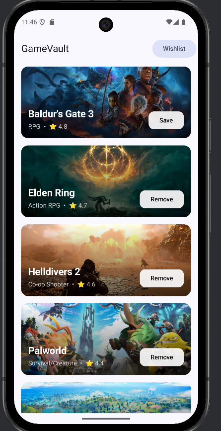
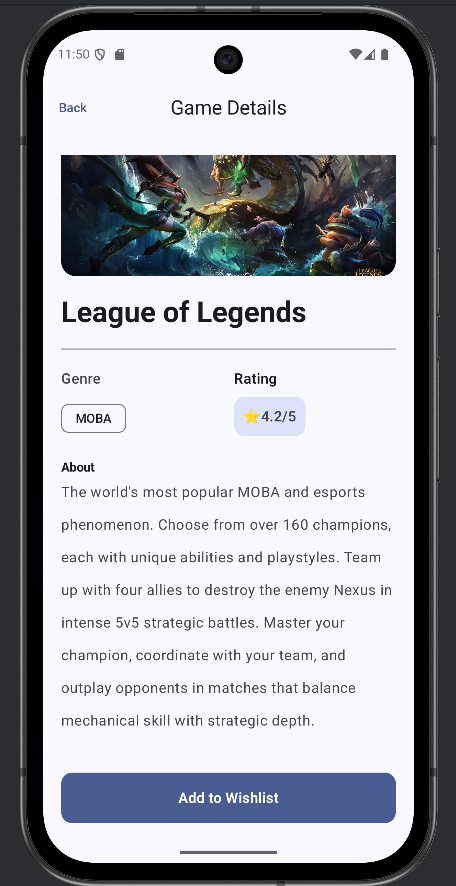
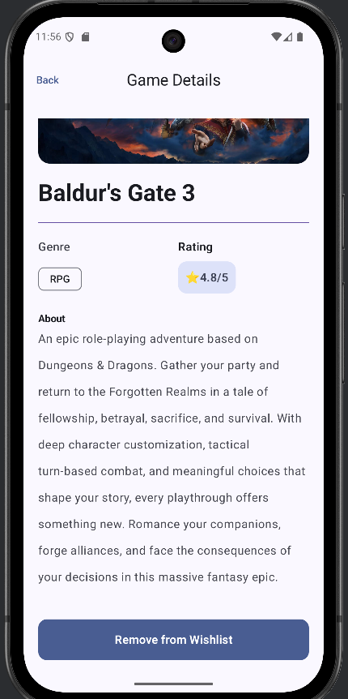
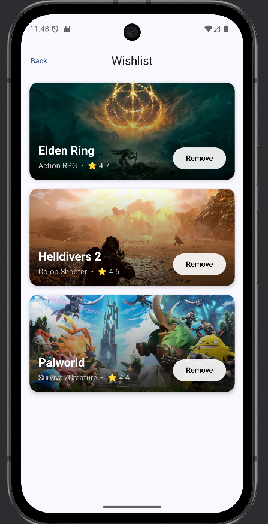
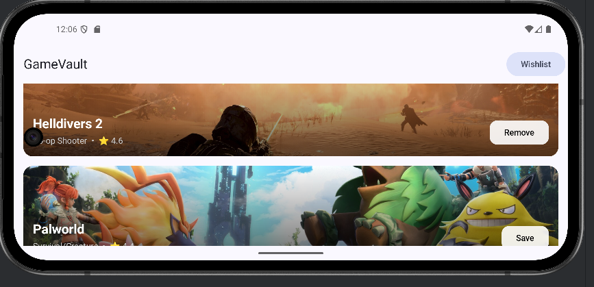

# GameVault

### CPSC 411A-02 – Team Project
**Team Members:**
- Hisham Panamthodi Kajahussain – CWID: 885147090
- Andrew Vu – CWID: 884555095
- Jose Manuel Gonzalez Alfaro – CWID: 802229633


## Overview

**GameVault** is a multi-screen Android application built with Jetpack Compose.  
It allows users to browse a list of top games, view detailed information about each title, and add or remove games from a personal wishlist.

The project demonstrates the use of key Android concepts taught in class:
- **Navigation** between multiple screens
- **State management** using `ViewModel` and `StateFlow`
- **Dynamic UI updates** through Compose reactive state
- **Clean and responsive layout** designed with Material 3


## Features

- **Home Screen:** Displays a list of popular games with title, genre, rating, and banner image.  
  Users can add or remove games from their wishlist directly from this screen.

- **Details Screen:** Shows extended information about a selected game, including description and banner image.  
  The wishlist toggle updates in real time across all screens.

- **Wishlist Screen:** Displays saved games in visually rich banner cards with quick remove options.


## Technical Implementation

- **Language:** Kotlin
- **UI Framework:** Jetpack Compose (Material 3)
- **Architecture Components:**
    - `ViewModel` for managing app state across screens
    - `StateFlow` collected with `collectAsStateWithLifecycle()` for reactive updates
    - `Navigation` for composable screen transitions
- **Data Source:** Hardcoded `GameList` containing 20 popular games with images and descriptions
- **State Management:**  
  The wishlist state is stored in the `GameViewModel` and shared across the Home, Details, and Wishlist screens.  
  ViewModel state persists through configuration changes (e.g., rotation).


## Screenshots

Place screenshots of each screen below.

**Home Screen**  


**Details Screen**  



**Wishlist Screen**  


**Screen Rotation**


## How It Works

1. **Home Screen**
    - Displays a list of hardcoded games.
    - Each game card includes banner image, title, genre, rating, and a Save/Remove button.
    - Tapping a card opens the Details screen.

2. **Details Screen**
    - Displays game information with a large banner image and full description.
    - Includes an "Add to Wishlist" or "Remove from Wishlist" button.

3. **Wishlist Screen**
    - Lists all games added to the wishlist.
    - Cards display game banners, titles, and quick remove buttons.
    - Tapping a card opens the Details screen for that game.


## App Structure
```
com.example.gamevault/
│
├── data/
│   └── GameList.kt
│
├── ui/
│   └── screens/
│       ├── HomeScreen.kt
│       ├── DetailsScreen.kt
│       └── WishlistScreen.kt
│
├── nav/
│   └── Navigation.kt
│
└── viewmodel/
    └── GameViewModel.kt
```

## Requirements Checklist

| Requirement                                | Implemented | Notes |
|--------------------------------------------|--------------|-------|
| Multiple screens using Navigation          | Yes          | Home, Details, Wishlist |
| ViewModel used to manage state             | Yes          | `GameViewModel` |
| State properly updates the UI              | Yes          | Uses `StateFlow` and Compose state |
| Uses hardcoded data                        | Yes          | `GameList.kt` |
| Functional and clean UI                    | Yes          | Material 3 theme |
| Bonus: visually appealing design           | Yes          | Banner-style cards and consistent layout |


## How to Run

1. Clone the repository:
   ```bash
   git clone https://github.com/jmgonzalez06/GameVault.git
   ```
2. Open the project in Android Studio (Giraffe or newer).
3. Build and run on an emulator or physical Android device running API 24 or higher.


## Demo Video

Insert the link to the unlisted YouTube video below:  
`[Insert Demo Video Link Here]`


## License

This project was created for **CPSC 411A-02 (Mobile Device Application Programming for Android)**  
at **California State University, Fullerton.**  
For educational purposes only.
